# Flawless Cooking Cookery School 

This website is designed for a fictional cooking school based in Cork, Ireland. It is complete with an enquiry form for potential clients to get in contact with the school, an about section to tell people a little about the teacher and a gallery page which shows images of past students to the school. There is also a recipes page with a sample brownie recipe. This page also contains a downloadable version of the recipe and a video on how to make a flaxseed egg for anyone who would like to make a vegan-friendly version of the brownie. 
This website has been created as the first Milestone project for Code Institute's Full Stack Software Development Diploma. 

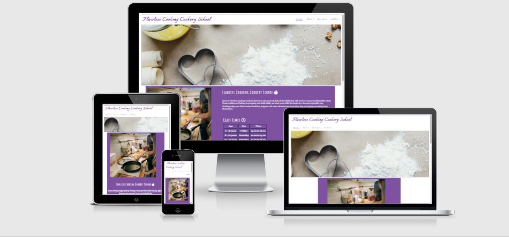

### View the live website [here](https://martiless.github.io/flawlesscooking/)
***
## Table of content: 
 1. [Site Goals](#Site-Goals)
 1. [UX](#UX)
      1. [User Stories](#User-Stories)
      1. [Development Planes](#Development-Planes)
            * [Strategy](#Strategy)
            * [Scope](#Scope)
            * [Structure](#Structure)
            * [Skeleton](#Skeleton)
            * [Surface](#Surface)
      1. [Color](#Color)
      1. [Font](#Font)
      1. [Images](#Images)
 1. [Features](#Features)
      1. [General](#General)
      1. [Home page](#Home-page)
      1. [About](#About)
      1. [Recipes](#Recipes)
      1. [Gallery](#Gallery)
 1. [Testing](#Testing)
 1. [Bugs](#Bugs)
 1. [Validation](#Validation)
 1. [Accessibilty](#Accessibilty)
 1. [Deployment](#Deployment)
 1. [Credits](#Credits)
      1. [Content](#Content)
      1. [Media](#Media)
      1. [Code](#Code)
***
  

## Site Goals:

The goals for this site are as follows:
* To provide information to users about kids cookery classes in Cork.
* To provide users with a downloadable sample recipe.
* To allow users to gain some information about the teacher.
* Gain more students to the school.
* Invite enquiries from parents with children interested in cooking.
* To provide easy to follow recipes that parents can do at home with their kids. 

## UX:

### User stories:
#### New User:  
* As a new user, I am looking to find information regarding cooking classes for kids.  
* As a new user, I am looking to contact the school.  
* As a new user, I would like to find out more about the person who will be teaching my child.  
* As a new user, I would like to see pictures of past students of the school.  
* As a new user, I would like to get an idea of the types of recipes my child will be learning.  

#### Returning User:
* As a returning user, I would like to find out if there are any new recipes available to download.
* As a returning user, I would like to see if there are any new class times added.
* As a returning user, I would like to see if any new class photos have been added.

## Development Planes:
To create a website that is comprehensive and informative for a user, as a developer you need to look at all aspects of the website and how someone who visits your website will use it. You have to consider all the user stories that have been outlined in the above sections.  

## Strategy
The strategy principal looks at user needs, as well product/service objectives. This websites target audience was broken down into three categories:
### Roles: 
* New User
* Existing User  

### Demographic:
* Parents of young children
* Grandparents of young children
* Resident in Cork, Ireland  

### Psychographic:
#### Lifestyle:
* Enjoy eating delicious food  
#### Values:
* Teaching children life skills at a young age
* Keeping food waste to a minimum  

#### The website needs to allow users to:  
* View times of classes for their child's age group  
* View information about the teacher  
* Contact the school with regards to classes  
* Download a sample recipe for trying at home  

#### The website needs to allow the teacher at the school to:  
* Receive enquiries from parents/grandparents/guardians   
* Receive emails from site visitors through the email icon  

## Scope:  

With the structure in place, it was then time to move onto the scope plane. This was all about developing website requirements based on the goals set out in the strategy plane. These requirements are broken down into two categories. 
### Content Requirements:
1. The user will be looking for:
      * Information on class times 
      * Information on the teacher
      * Sample recipes they can try with their kids
      * Techniques on how to make something they may not have done before
### Functionality Requirements:
1. The user will be able to:
      * Navigate through the site to find the information they need
      * Send an email to the school via an enquiry form on the site.
      * Download a copy of easy recipes to do at home
      * Watch a video on how to make a flaxseed egg  

## Structure:

The information above was then used to create a structure for the website. Below is a site map showing how users can navigate the website intuitively 

Sitemap

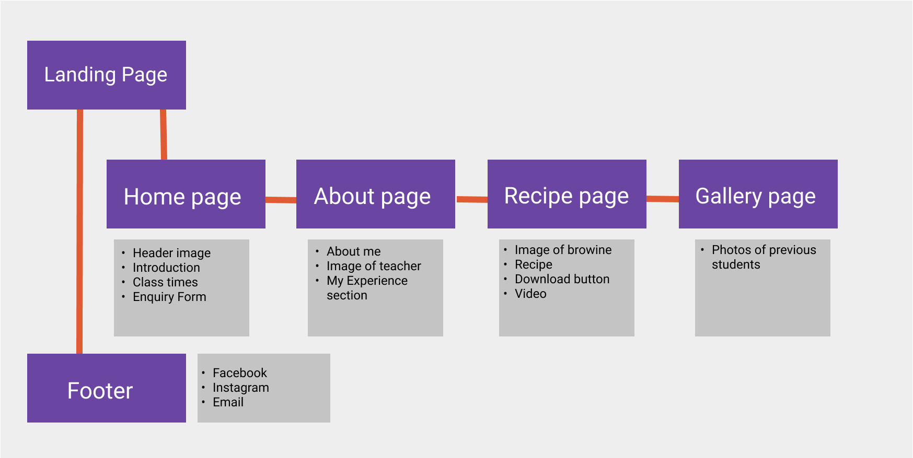

## Skeleton:
[Wireframes](WIREFRAME.md "Link to Wireframe screenshots") were created to set out the initial appearance of the website while also making sure to keep the end-user in mind at all times. Wireframes were created using [Balsamiq](https://balsamiq.com/).  

## Surface:
[Please see the live site here](https://martiless.github.io/flawlesscooking/)  

### Color: 
To create a visually appealing website but also a website that was easy for people to read I used several different sites to test color contrast. I wanted to make sure the color scheme was not only eye-catching but also that it passed the LightHouse Accessibility test. 

Initially, I looked at what colors work best with the purple color I had chosen as my main color. I did this by using a color wheel.  
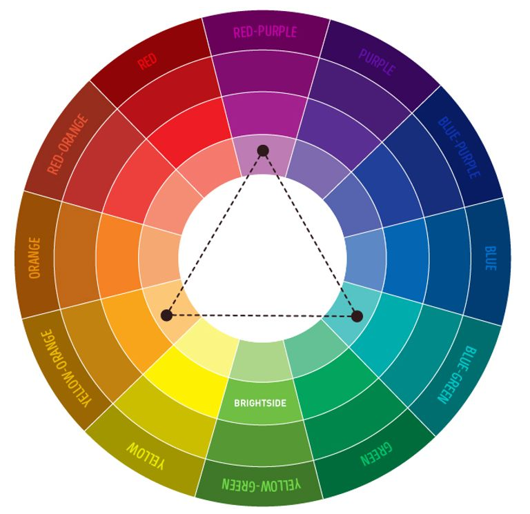

Following on from the color wheel, an orange was decided upon to contrast the purple. To make sure text could be seen without issue on my chosen colors I used [Coolors](https://coolors.co/) color contrast checker.

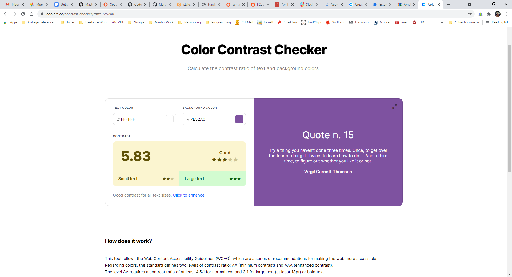
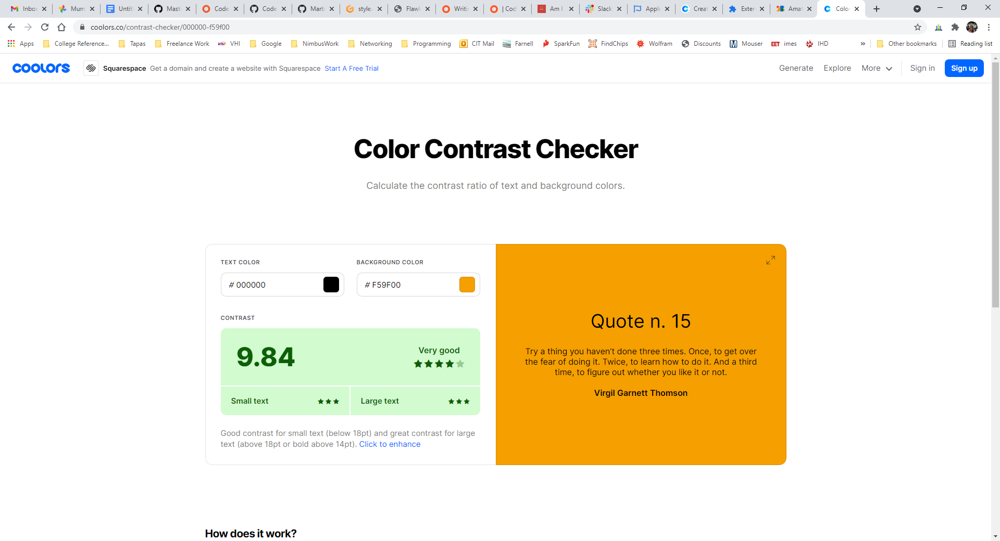

### Font:

The font pairing for this website was [Italianno](https://fonts.google.com/specimen/Italianno?preview.text=Love%20Running%20&preview.text_type=custom&query=ita) [Roboto](https://fonts.google.com/specimen/Roboto?preview.text=Love%20Running%20&preview.text_type=custom&query=ro) and [Amatic SC](https://fonts.google.com/specimen/Amatic+SC?query=Amatic+SC), all of which were imported from [Google Fonts](https://fonts.google.com/), with a backup font family of Sans-Serif in case there were any issues with the imported fonts  

*Italianno* was used as the font in the header section of the website. *Amatic SC* was used for all headings throughout the website with *Roboto* being used for all the text areas.  

### Images:

A lot of the imagery on this site was sourced from [Pexel](https://www.pexels.com/) with some real life images too.  
All the images that were sourced from Pexel were uploaded to the site initially and were placed on the gallery page. However, after testing the site on a number of people it was said the images were taking too long to load and slowing down the Gallery page. To enhance the user experience on the Gallery page all the Pexel images were compressed and uploaded again. This meant that the quality of the image was still high while the page loaded quicker making it a nicer experience for any potential user.  

***
[Back to top](#Flawless-Cooking-Cookery-School)  
  

## Features:
There are several features on this site to help users get the most out of their visit to the site.  

### General:
#### Header and Navigation:  
Each page has a Header and Navigation bar section. This section is at the top of each page and moves down as the user scrolls down the page allowing them to navigate between pages without the need to scroll back to the top. The navigation bar consisted of links to an *About* page, a *Recipes* page and a *Gallery*, as well as a *Home* button that brings the user back to the landing page.  
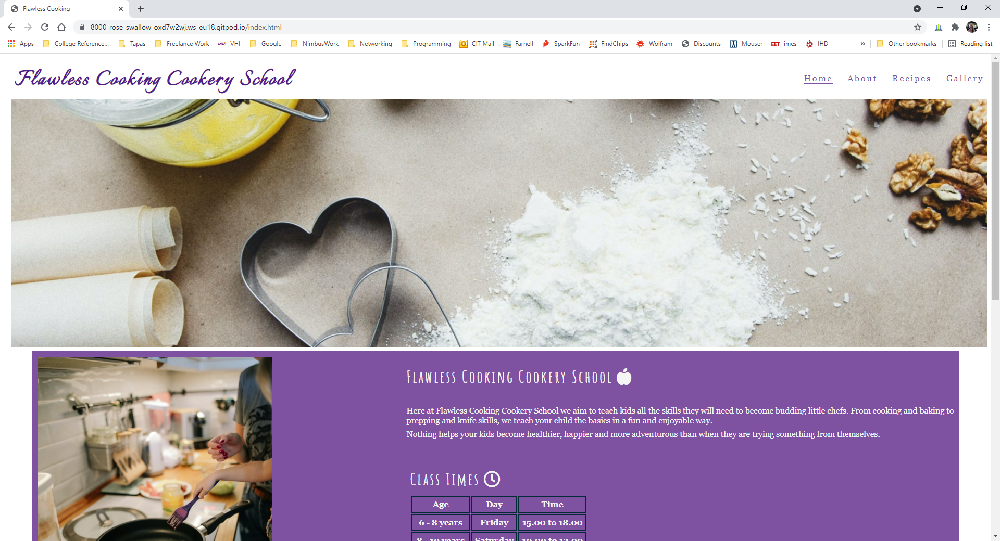  
#### Footer:  
Each page also has a footer element. This contains links to the school's social media pages, i.e Facebook and Instagram, along with an email button that allows a user to send an email to the school from their email account. All of these icons, when clicked will open in a new tab.  
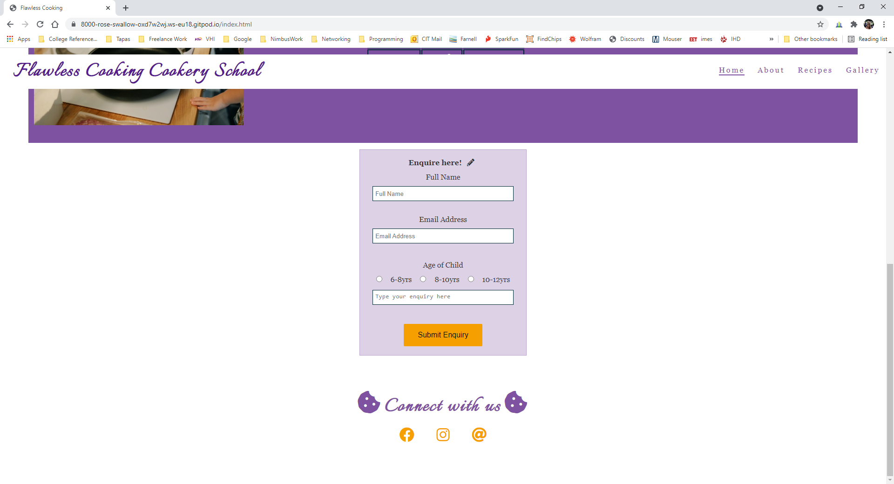
### Home page:
The *Home* page contains all the header and footer features mentioned above.  
#### Main Section:
In the main section of the *Home* page, there is the main image (or hero image) followed by an introductory section, which contains an image, a paragraph about the school and a timetable for classes.  
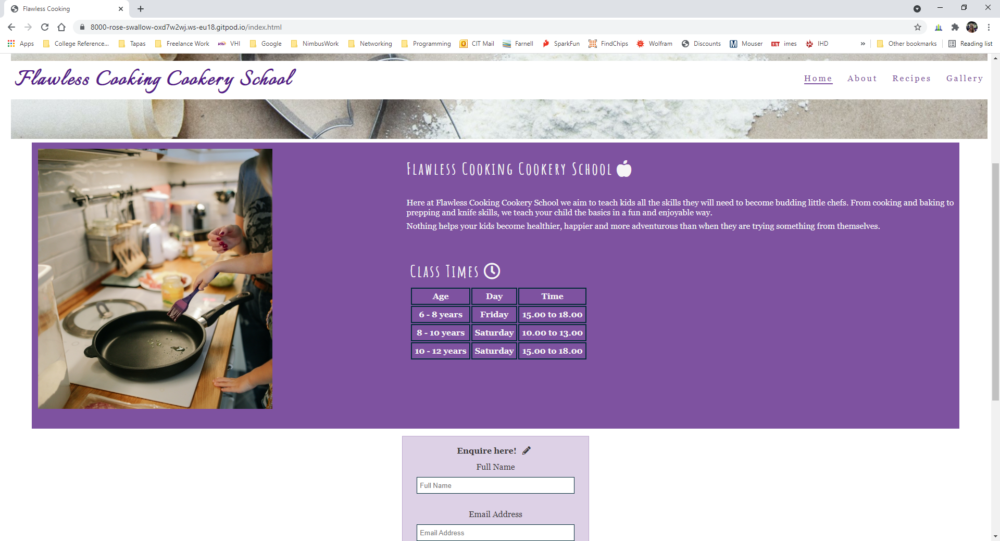

#### Enquiry Form:
The next thing a user will be met with is an enquiry form. This can be used to contact the school if they are interested in a class for a child. All sections of the enquiry form must be filled out before submitting it. If it is not complete an error message will appear to inform the user they are missing some information.  
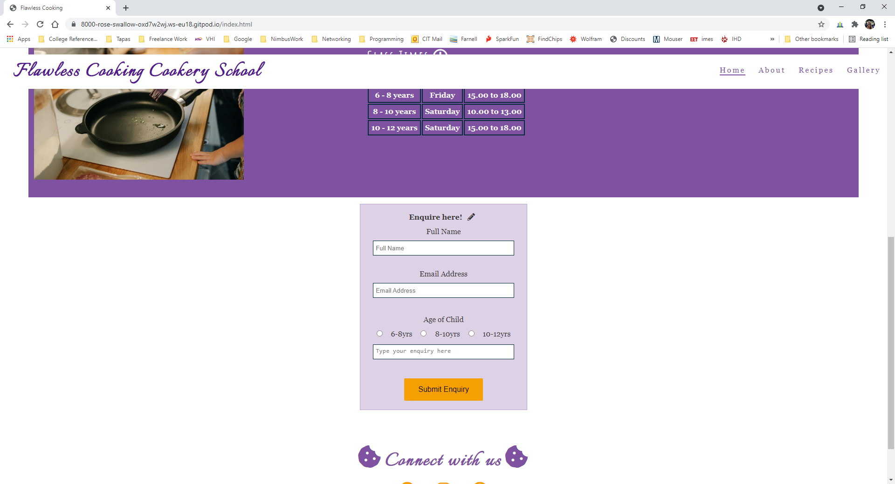
### About:
The next page on the website is an *About* page. This page contains all the header and footer features mentioned above.
#### About Me:
This page contains a section that allows the user to click through to the websites of restaurants the teacher has previously worked. 
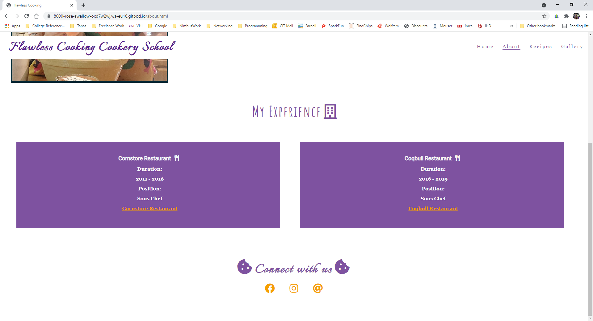  

### Recipes:
The next page on the website is a *Recipes* page. This page contains all the header and footer features mentioned above, as well as a link within the ingredients section that directs users to a video at the bottom of the page. 
#### Download and Video:
Within the recipes page, a user can scroll down to a section where there is a *download this recipe here* button. This opens the recipe on a new page where the user can download it to their desired device.  
It also has an embedded video on how to *Make a Flaxseed Egg* for any user who would like to make a vegan-friendly version of the brownie.  
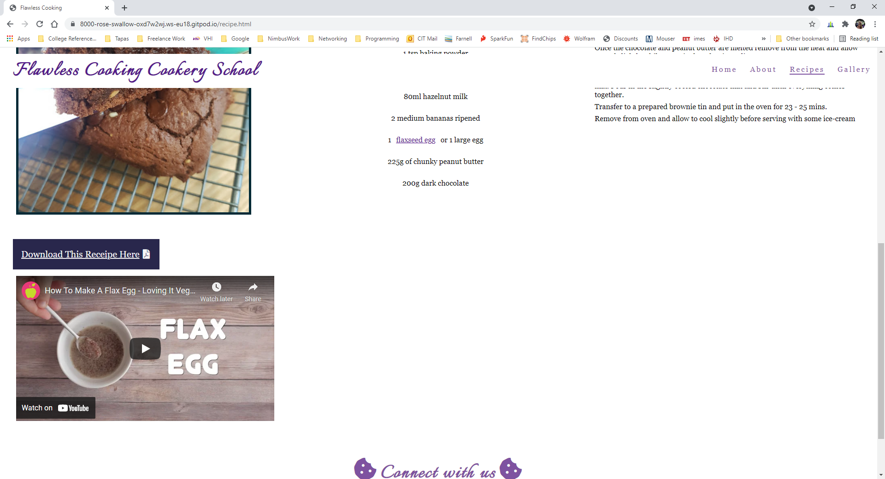  

### Gallery: 
The final page on the website is a *Gallery* page. This page contains all the header and footer features mentioned above.  
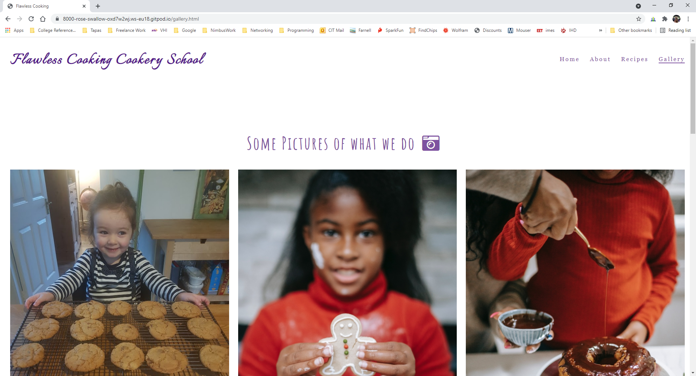

## Future Features:
* A rolling gallery in the *Gallery* page instead of a static gallery.
* An upload your images section that allows users to upload images of recipes they have tried out.
* A shop where users can buy vouchers or cooking equipment and accessories. 
* A rolling testimonial in the footer, allowing users to see feedback from previous clients.

***
[Back to top](#Flawless-Cooking-Cookery-School)  

## Testing:
Testing information can be viewed [here](TESTING.md "Link to testing information")

***

## Bugs:
1. Font Awesome fonts are copied into the code but when the website is loaded are not showing up. 
      1. I had forgotten to add the Font Awesome source code to the footer section of each page.
1. The main image not loading when the page is refreshed.
      1. Looked at the source to make sure I was using the correct syntax, I had added in an extra full stop. Removing this extra full stop solved my issue.
1. The second image not cropping correctly.
      1. Instead of using the same method as the header image, I inserted the second image in the HTML as a < img > tag and styled it using CSS
1. Image and text in "Middle" would not wrap for me. 
      1. I tried a number of things including rewriting the code, troubleshooting to see if I had used the wrong code in the first place and eventually contacted the Code Institute tutors to see if I could get a better understanding as to why this was not working for me the way I wanted it to. 
      1. After speaking with a tutor I was able to see that I had to take a closer look at my margins and padding to allow both the image and text to fit side by side in the designated area.
1. About page would not load correctly after adding the media queries to the page.
      1. Used Google Dev Tools to try and fix the code. The code was in GitPod but not appearing in Dev tools
      1. Tried hard refreshes
      1. Tried rewriting the code
      1. Finally contacted the Code Institute tutors who helped me see that I was missing some closing brackets from a previous media query that was causing the code from the About page to be overwritten. Once these brackets were closed the page loaded correctly.
1. When I was making my site responsive pages recipe page started to load wrong, i.e the footer was above the middle section of the page. 
      1. I was having a really hard time with this one as I had double and triple checked all my code in GitPod and also used Google Dev tools and couldn't see any problem. I eventually decided to used the Tutor service where one of the tutors explained to me about flex and flex-box as a way of displaying content instead of floats. By changing the image's CSS from a float to a flex corrected the issue I was having.
1. Navigation bar was not responding correctly when viewed in tablet form. 
      1. Used Google Dev Tools to try different methods of getting the page to work.
      1. Eventually discovered that the margin wasn't set correctly as it was still set to the default margins.
1. While generating the LightHouse Report I was getting an error due to some code that was appearing at the end of each of my .html files, but that I had not written nor was it appearing in GitPod
      1. I went through all the extensions I have installed on Google Chrome and discovered that an app was inserting code into the site while in preview mode.
      1. I disabled the app and ran the Lighthouse report again which came back without the same feedback.

***
[Back to top](#Flawless-Cooking-Cookery-School) 

## Validation:

See screenshot to W3C validator and Jigsaw CSS validator [here](VALIDATION.md "Link to validation screenshots")

### **Index.html:**
No errors found. 

### **About.html:**
No errors found

### **Recipe.html:**
No errors found

### **Gallery.html:**
No errors found

### **Style.css:**
No errors found
***
## Accessibility:
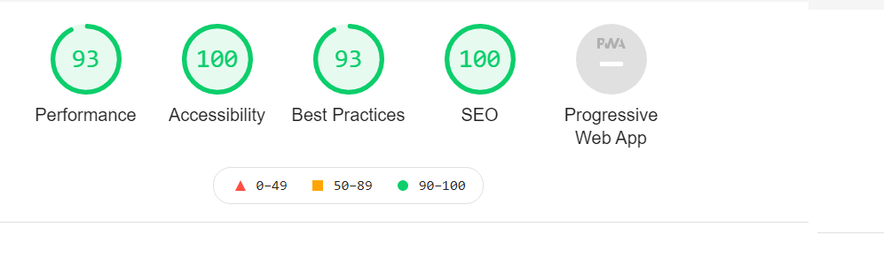
***
## Deployment:
This project was developed using [GitPod](https://gitpod.io/), committed and pushed to [GitHub](https://github.com/) using a GitPod terminal.

Deploying on GitHub Pages
To deploy this page to GitHub Pages from its GitHub repository, the following steps were taken:

1. Log into GitHub.
1. Locate the GitHub Repository you are using.
1. At the top of the repository, select Settings from the menu items.
1. Scroll down the Settings page to the "GitHub Pages" section.
1. Click on the link provided. To opens a new tab, right click on your mouse and select open in new tab.
1. Under "Source" click the drop-down menu labelled "None" and select "Main". Once this is done click on "save"
1. Once you have clicked save, the page will automatically refresh. You will now get a link to the deployed website.
1. Copy this link and off you go. 

***
## Credits:

### Content:

1. The icons used throughout the website were taken from [Font Awesome](https://fontawesome.com/)  
1. The logo and heading fonts were taken from [Google Fonts](https://fonts.google.com/)
1. Instructions on who to crop an image was taken from [Digital Ocean](https://www.digitalocean.com/)

### Media:

1. Images for this site were downloaded from [Pexel](https://www.pexels.com/)
1. Video on how to make a flaxseed egg taken from [YouTube](https://www.youtube.com/watch?v=ouUW810R5to)

### Code:

1. I used various coder forums at times when I had difficulty with aspects of the code. The use of sites such as [W3 Schools](https://www.w3schools.com/) and [Stack Overflow](https://stackoverflow.com/) was hugely helpful, as well as coding community sites like [Site Point Community](https://www.sitepoint.com/community/)  
Any code taken from these sites were edited to suit the needs of this site. 
1. CSS Code for the image on the *Recipe* page was help with by the tutors from Code Institute  

*** 
[Back to top](#Flawless-Cooking-Cookery-School) 